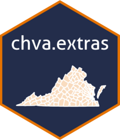

<!-- README.md is generated from README.Rmd. Please edit that file -->


```{r, include = FALSE}
knitr::opts_chunk$set(
  collapse = TRUE,
  comment = "#>",
  fig.path = "man/figures/README-",
  out.width = "100%"
)
```

# chva.extras  

<!-- badges: start -->
[](https://github.com/le-huynh/chva.extras/actions/workflows/R-CMD-check.yaml)
[](https://lifecycle.r-lib.org/articles/stages.html#stable)
<!-- badges: end -->


Supplementary Tools for Climate and Health Research in VA  

`chva.extras` is a collection of supplementary functions and templates designed 
to support climate and health research in VA, including tools for data manipulation, 
analysis, and visualization, tailored to handle large datasets.  

## Installation

To get the latest in-development features, install the development version from GitHub:

``` r
if(!requireNamespace("devtools", quietly = TRUE)) {
 install.packages("devtools")
}
devtools::install_github("le-huynh/chva.extras")
```

### Functions
See [Package index](https://le-huynh.github.io/chva.extras/reference/index.html) for full list of functions.  

1. Convert files to Parquet format  
- `get_parquet_arrow()`: Convert multiple files to Parquet format.  
- `get_parquet_by_chunk()`: Convert file to Parquet format by chunks.  

2. Support handy workflow
- `check_overview()`: Provide an overview of datasets.  
- `check_unique_value()`: Count unique values of a specified column.  
- `get_dataset()`: Get full working datasets as a named list of [Dataset](https://arrow.apache.org/docs/r/reference/Dataset.html) R6 objects.  
- `recode_values()`: Recode values based on grouping logic.  

3. Compute additional indices used in climate health research
- [updating]


### Templates
- [updating]

